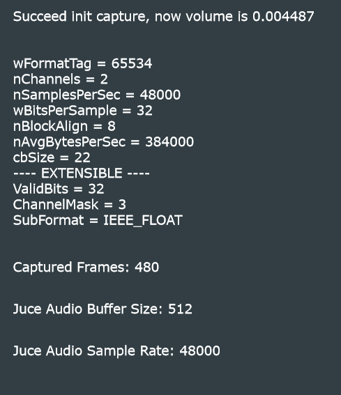

# UYOMPO

**Languages:** [English](#english) | [中文](#chinese)

<a id="english"></a>

## English

- [Overview](#en-overview)
- [Features](#en-features)
- [Usage Notes](#en-usage)
- [Roadmap](#en-roadmap)
- [Build (Projucer)](#en-build)
- [Dependencies & Platform](#en-deps)
- [Project Structure](#en-structure)

<a id="en-overview"></a>

### Overview

UYOMPO is a JUCE-based VST3 audio plugin. This repository includes the JUCE source code and the Projucer project configuration needed to build it.

<a id="en-features"></a>

### Features

UYOMPO captures the system default audio input on Windows and exposes it as the plugin input inside a DAW.

In many DAW setups, audio I/O is tied to an external audio interface, which can make it inconvenient (or impossible) to use the laptop’s built-in microphone as an input source. UYOMPO bypasses the DAW’s audio-device input routing and captures the system default input directly via the Windows API (WASAPI), then feeds it into the plugin for processing.

<a id="en-usage"></a>

### Usage Notes

1. Windows only. Requires the WASAPI backend.
2. Current behavior is “replace the track’s audio with the captured microphone stream.” Insert it on an empty track and place it at the beginning of the plugin chain to avoid overwriting other audio.
3. Resampling is supported. However, we still recommend keeping the host project and audio interface sample rates consistent with the system default input device sample rate to reduce plugin CPU load and avoid unknown issues.
4. The plugin captures the system **default input device**. Make sure the default input device is set correctly in Windows sound settings. After changing audio settings or doing other system audio operations, Windows may switch the default device automatically.
5. Hot-plugging is not supported yet. If you change the default input device or modify the DAW’s audio device settings during use, restart the host so the plugin can re-bind to the new default input.
6. There are currently no adjustable parameters, so the UI is intentionally minimal and shows only basic information (e.g., input sample rate).



<a id="en-roadmap"></a>

### Roadmap

1. Add a “Replace/Mix” mode switch to either replace the track audio or mix the captured audio with the track.
2. Add output gain control.
~~3. Improve resampling: fix crackling/popping when the project sample rate differs from the system input sample rate.~~ (Completed)
4. Add adaptive noise-reduction tailored to suppress common laptop fan and mechanical noise near built-in microphones.
5. Add support for audio device hot-plugging.

<a id="en-build"></a>

### Build (Projucer)

1. Install and open `Projucer`.
2. Open `UYOMPO.jucer` in Projucer.
3. Go to `Exporters`, then add or confirm the `Visual Studio 2022` exporter (add others if needed, e.g., Xcode, Linux Makefile).
4. Save the project (`File -> Save Project`), then click `Save Project and Open in IDE` (if available), or open the generated IDE solution manually (usually in `Builds/VisualStudio2022/`).
5. In Visual Studio, select `Debug` or `Release` and build.
6. After building, run the generated standalone executable or copy the plugin binary into your DAW’s plugin folder for testing.

<a id="en-deps"></a>

### Dependencies & Platform

- Built with JUCE; Projucer is recommended for project configuration.
- Windows only (WASAPI backend).
- Links against `avrt.lib` (already configured in the `.jucer` file).

<a id="en-structure"></a>

### Project Structure

```
UYOMPO/
├── UYOMPO.jucer
└── Source/
    ├── PluginProcessor.*
    ├── PluginEditor.*
    ├── SharedRingBuffer/
    └── WASAPI/
```

- `PluginProcessor`: core audio processing logic, including callbacks, buffering, parameters, and plugin lifecycle.
- `PluginEditor`: UI layer; draws the UI, handles user interaction, and communicates with `PluginProcessor`.
- `SharedRingBuffer`: internal ring buffer implementation for safe cross-thread/module audio/message transfer.
- `WASAPI`: Windows-specific audio backend; wraps WASAPI capture and device management.

---

<a id="chinese"></a>

## 中文

- [概述](#zh-overview)
- [功能介绍](#zh-features)
- [使用说明](#zh-usage)
- [后续计划](#zh-roadmap)
- [构建方式（Projucer）](#zh-build)
- [依赖与平台](#zh-deps)
- [项目结构概览](#zh-structure)

<a id="zh-overview"></a>

### 概述

UYOMPO 是一款基于 JUCE 框架的 VST3 音频插件。本仓库包含用于构建的 JUCE 源码以及 Projucer 项目配置文件。

<a id="zh-features"></a>

### 功能介绍

该插件可捕获 Windows 系统的默认音频输入，并在 DAW 中作为音频源播放/处理。

一般情况下，DAW 会使用独立声卡的输入/输出接口进行录音与监听，此时往往无法将笔记本内置麦克风作为输入源。UYOMPO 可绕过 DAW 本身的音频接口，直接通过 Windows 系统 API（WASAPI）捕获系统默认音频输入（如内置麦克风），并将其作为插件输入源进行处理。

<a id="zh-usage"></a>

### 使用说明

1. 仅支持 Windows 平台，依赖 WASAPI 音频后端。
2. 当前工作模式为“用麦克风采集数据替换某一轨道的音频”。请将其插入到空轨道，并放在插件链最前端，以避免覆盖其他音频内容。
3. 支持重采样。但仍建议将宿主工程及声卡采样率与系统默认输入设备采样率保持一致，以减小插件运算量并避免未知问题。
4. 插件捕获的是系统“默认输入设备”。请在 Windows 音频设置中正确配置默认输入；在更改声卡设置或进行其他系统音频操作后，Windows 可能会自动切换默认输入设备。
5. 暂不支持音频设备热插拔。使用过程中如更改了默认输入设备，或调整了 DAW 的音频接口设置，建议重启宿主程序以确保插件重新绑定到新的默认输入设备。
6. 当前版本暂无可调参数，因此界面较为简洁，仅展示基础信息（如系统输入采样率等）。


<a id="zh-roadmap"></a>

### 后续计划

1. 增加“Replace/Mix”模式切换：支持替换轨道音频，或将捕获音频与轨道音频混合。
2. 增加输出增益控制。
~~3. 优化重采样：解决工程采样率与系统输入采样率不一致时的爆音问题。~~（已完成）
4. 增加针对笔记本内置麦克风附近风扇与机械噪声的自适应降噪支持。
5. 增加对音频设备热插拔的支持。

<a id="zh-build"></a>

### 构建方式（使用 Projucer）

1. 安装并打开 `Projucer`。
2. 在 Projucer 中打开项目文件 `UYOMPO.jucer`。
3. 选择左侧 `Exporters`，添加或确认已存在 `Visual Studio 2022` 导出器；按需添加其他导出器（如 Xcode、Linux Makefile）。
4. 保存项目（`File -> Save Project`），然后点击 `Save Project and Open in IDE`（如可用）；或手动打开生成的 IDE 工程，通常位于 `Builds/VisualStudio2022/`。
5. 在 Visual Studio 中选择目标配置（`Debug` 或 `Release`）并构建。
6. 构建完成后，运行生成的可执行文件，或将插件二进制拷贝到宿主/DAW 的插件目录进行测试。

<a id="zh-deps"></a>

### 依赖与平台

- 依赖 JUCE 框架，推荐使用 Projucer 进行配置。
- 依赖 Windows 平台特有的 WASAPI 音频后端，需要在 Windows 上构建与运行。
- 需要链接 `avrt.lib`（已写入 `.jucer` 配置文件）。

<a id="zh-structure"></a>

### 项目结构概览（Git 仓库）

```
UYOMPO/
├── UYOMPO.jucer
└── Source/
    ├── PluginProcessor.*
    ├── PluginEditor.*
    ├── SharedRingBuffer/
    └── WASAPI/
```

- `PluginProcessor`：音频处理核心模块，包含处理回调、缓冲、参数与插件生命周期逻辑。
- `PluginEditor`：插件图形界面模块，负责 UI 绘制、用户交互，并与 `PluginProcessor` 交换控制事件。
- `SharedRingBuffer`：项目内部环形缓冲区实现，用于在不同线程/模块间安全传递音频或消息数据（例如在宿主与音频回调之间共享音频流）。
- `WASAPI`：Windows 专用音频后端代码，封装 WASAPI 捕获逻辑与设备管理。


